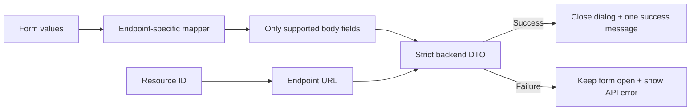

# Mahder E2E Stabilization Report — Frontend

## 1. Executive summary

The web dashboards now send request bodies that match the backend's strict DTOs,
use consistent production sessions, and show clearer units during task setup.
Forms close only after successful requests, reducing confusing “success” states
when the API actually rejected a payload.

## 2. Request-flow illustration

Before:

```text
Form -> body includes URL IDs/unsupported fields -> strict API returns 400
     -> duplicate toast or dialog closes early -> user is unsure what happened
```

After:



## 3. What was improved

- Removed the custom production session-cookie override so NextAuth and
  middleware use the same secure cookie.
- Kept assignment, instruction, approval, flag, and rejection IDs in URLs rather
  than sending unsupported body properties.
- Added endpoint-specific reference-data create/update mappings.
- Prepopulated dialect-language, region-country, and zone-region relationships
  during editing.
- Kept annotation updates within the current backend DTO (`name` and
  `description`).
- Added explicit labels for days, minutes, seconds, characters, years, counts,
  retries, batches, and credits.
- Awaited mutations and removed duplicate notifications.
- Refetched the Reviewer task panel on mount/focus, separated role-specific query
  caches, and showed a retry action when task loading fails.
- Preserved contributor day-to-hour conversion without converting failed retries
  twice.

## 4. Verification performed

- `pnpm test`: 21/21 request-contract tests passed.
- `pnpm exec tsc --noEmit`: passed.
- `pnpm build`: completed successfully, including lint and type validation.
- Production bundle contains `https://mahder-api.duckdns.org/api`.
- Public login redirect and frontend health endpoint returned HTTP 200.

Existing repository lint warnings are still reported, but the build has no lint
errors or TypeScript failures.

## 5. Presenter checklist

```text
SuperAdmin:      reference data and project
ProjectManager:  task, users, instructions, distribution
Contributor:     four Amharic recordings
Reviewer:        approve 3, reject 1, approve retry
Facilitator:     view paired contributors and history
Wallet:          confirm credit deltas and idempotency
```

Use an incognito window or clear old `mahder.duckdns.org` cookies once after the
deployment so an obsolete session cookie cannot affect the demonstration.

---

## 6. Pull request — copy/paste

### PR title

```text
fix: align production E2E forms and sessions with strict API contracts
```

### PR target

```text
main
```

### PR description

#### Summary

Aligns the Mahder web dashboards with strict backend DTOs and stabilizes the
role-based production E2E workflow.

#### Main changes

- Fix production NextAuth session-cookie compatibility with middleware.
- Send endpoint-specific reference-data, assignment, and instruction payloads.
- Keep resource IDs in URLs and remove unsupported request-body fields.
- Restore edit prepopulation for dialect, region, zone, and annotation relations.
- Await mutations and avoid duplicate success/error notifications.
- Prevent stale Reviewer/Facilitator task caches and add a retryable Reviewer
  task-loading error state.
- Clarify task configuration units and preserve deadline conversions.
- Add and extend request-contract regression coverage.

#### Verification

- `pnpm test` passed: 21/21 tests.
- TypeScript no-emit check passed.
- `pnpm build` completed successfully.
- Production frontend/API health checks returned HTTP 200.

#### Safety notes

- No credentials or environment files are included.
- Private storage and signed URLs remain enabled.
- Withdrawals and OneSignal delivery remain disabled.
